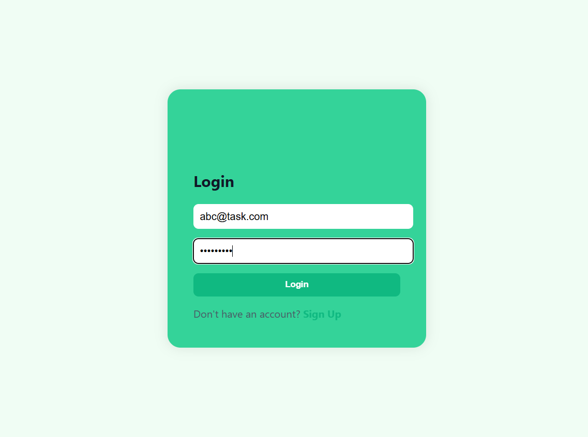
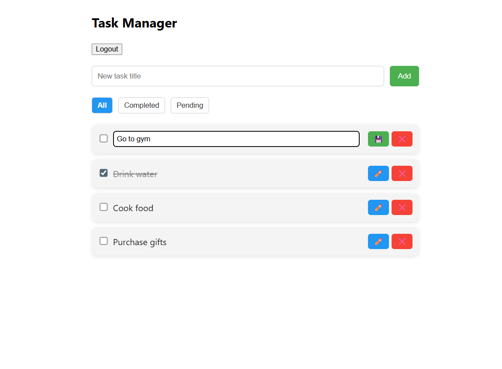

# Task Manager

**Task Manager** is a full-stack task management application built for productivity and ease of use. It allows users to register, log in, and manage tasks with full CRUD (Create, Read, Update, Delete) operations in a clean and responsive interface.

## Features

- **Add Tasks**: Users can input new tasks and add them to the list.
- **Edit Tasks**: Users can modify the task name.
- **Complete Tasks**: Tasks that are completed are visually crossed out.
- **Delete Tasks**: Users can remove tasks from the list.

## Tech Stack

- **Frontend**: React, HTML, CSS, JavaScript
- **Backend**: Node.js with Express
- **Database**: MongoDB with Mongoose for database interaction
- **Authentication**: JWT (JSON Web Tokens)
- **Hosting**: Vercel (Frontend), Render (Backend)


## Preview





## Setup Instructions

1. Clone the repository:
   ```bash
   git clone https://github.com/BavithSuvarna/Task-Manager.git
   ```
2. Navigate into the project directory:
   ```bash
   cd Task-Manager
   ```
3. Install frontend dependencies
   ```bash
   cd client
   npm install
   ```
4. Install backend dependencies
   ```bash
   cd ../server
   npm install
   ```
5. Set up Environment Variables
     - Create a .env file inside the server/ directory and add the following:
       - PORT=5000
       - MONGO_URI=your_mongodb_connection_string
       - JWT_SECRET=your_jwt_secret
     - If you have environment-specific frontend URLs or API endpoints, you may also configure .env in the client/ directory.
6. Start the application:
     Start the backend server:
     ```bash
     cd server
     node server.js
     ```
     Start the frontend app:
     ```bash
     cd ../client
     npm start
     ```
7. Visit the application at http://localhost:3000 in your browser.
